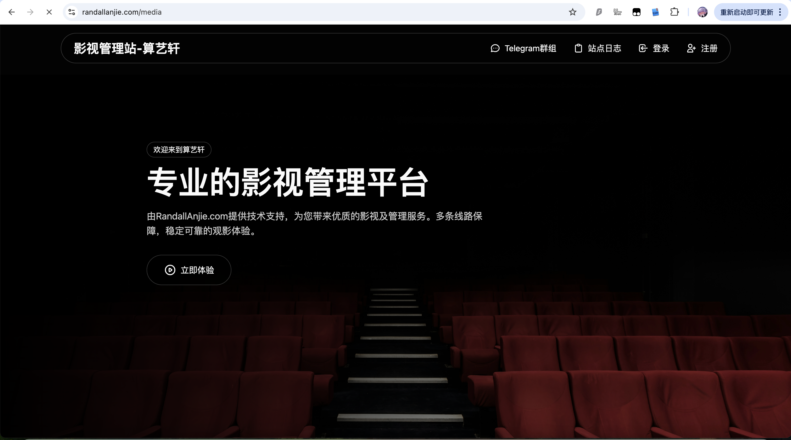
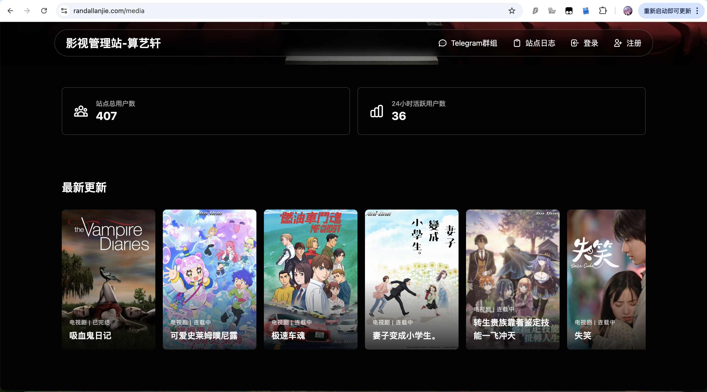
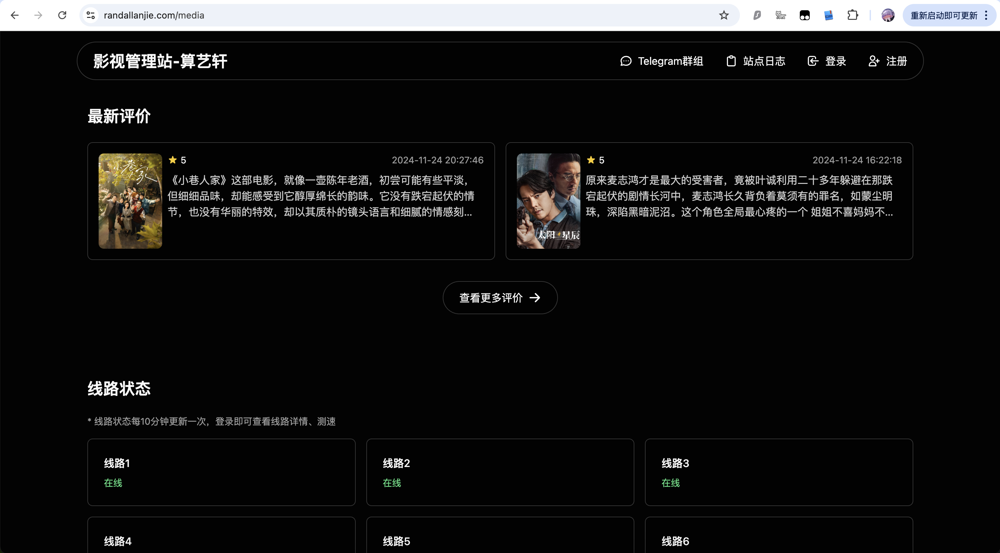
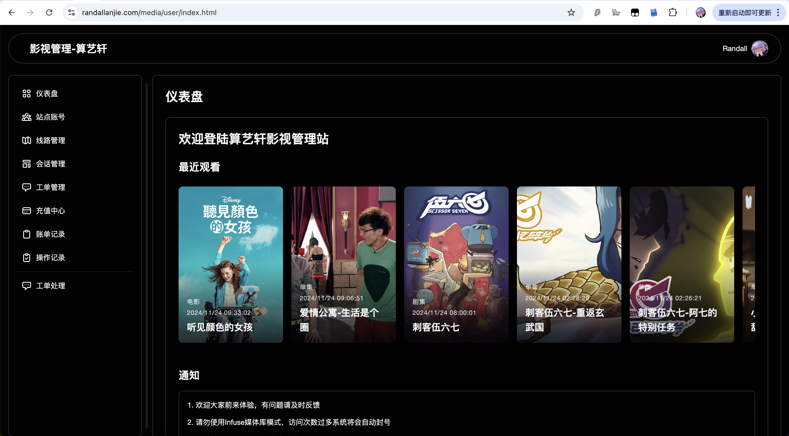
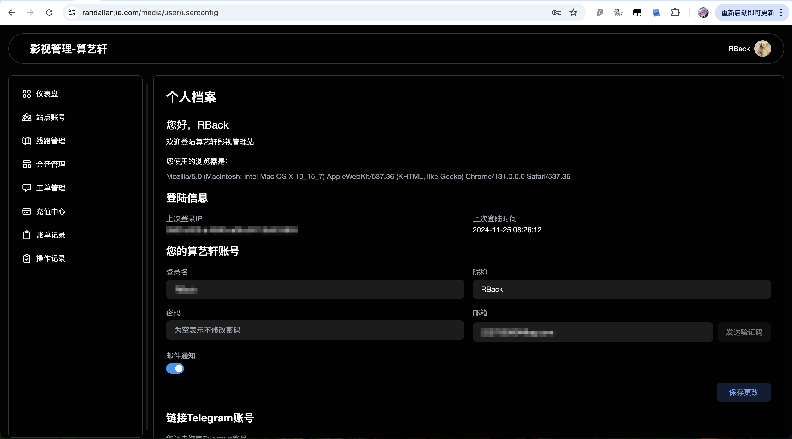
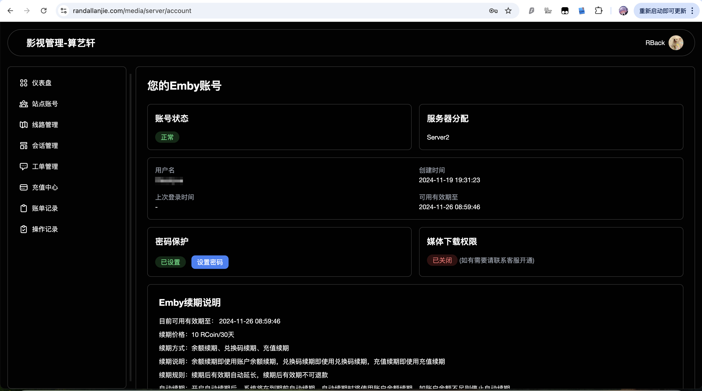
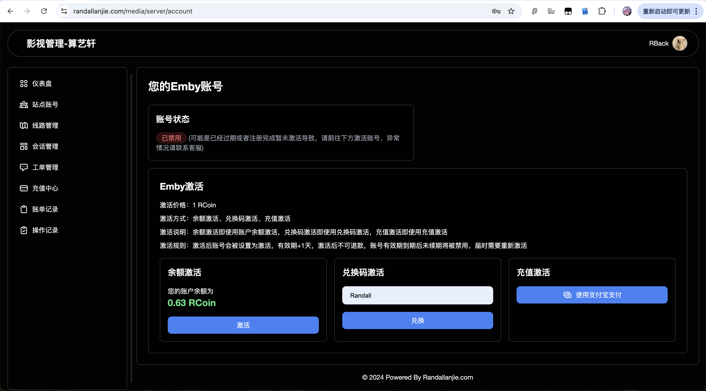
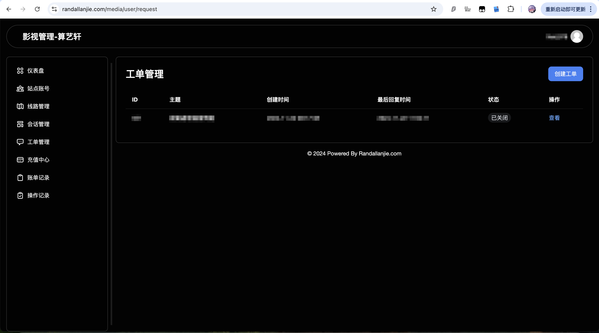
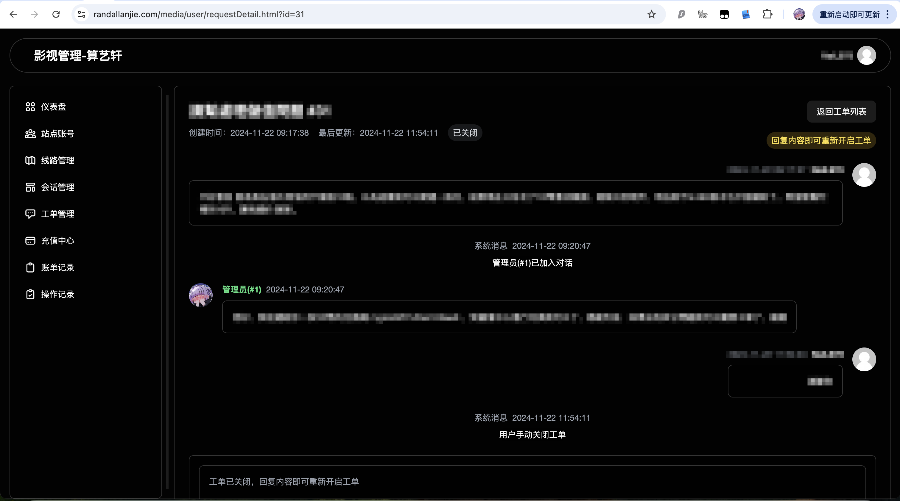

# EMBY 影视管理系统

## 演示以及最新Beta功能

- [影视管理-算艺轩](https://randallanjie.com/media)
- [TG群组](https://t.me/randall_home)

## 概述

该项目是一个用于管理EMBY的影视管理系统，提供了用户注册、登录、密码找回、最近更新显示、影片评价系统、EMBY账号管理、激活、改密、查看影视站线路、测速、会话查看、工单、充值、签到、邮箱和Telegram机器人通知等功能。

## 更新日志

### 2024-12-02 `V0.1.5`
- 新增站内通知
- 新增站内聊天
- 优化了代码中配置的调用用方式，全部改为 `.env` 调用

### 2024-11-29 `V0.1.4`
- 修复了Telegram通知的部分bug
- 重构了影评系统
- 重构了Telegram影视评价系统
- 新增了播放历史

### 2024-11-21 `V0.1.3`
- 重构了前端页面
- 修复了Telegram机器人签到时余额不会增加的bug
- 对于页面中行数过多的页面，新增分页工具

### 2024-11-16 `V0.1.2`
- 完善Telegram机器人，并且开放邮箱/TG通知功能
- 优化工单通知，新工单会将标题展示于群中便于讨论
- 为解决页面加载问题，账单/操作/工单记录只显示最近的10条记录
- 优化页面响应速度

### 2024-11-11 `V0.1.1`
- 修复了部分bug
- 新增使用余额自动续期功能
- 更新了工单的部分逻辑
- 完善了邮箱通知类别
- 适配移动端
- 新增账单重新支付功能，便于由于误操作未再购买页面付款后支付二维码丢失需要重新下单的操作
- 由于无法复现账单支付成功后购买商品未到账的情况，新增账单重新检测功能，如果遇到未到账的情况请发工单提供部分信息，核实后发放奖励

### 2024-11-06 `V0.1.0`
- V0.1.0 版本发布，开始内测

## 功能

- **用户管理**：注册、登录、密码找回
- **影视管理**：显示最近更新、影片评价系统
- **EMBY账号管理**：账号创建、激活、改密
- **站点管理**：查看影视站线路、测速
- **会话管理**：查看活跃会话
- **工单系统**：提交和管理支持工单
- **充值**：用户账号充值
- **签到系统**：每日签到获取奖励
- **通知**：通过邮箱和Telegram机器人接收通知

## 预览

### 首页





### 控制台



### 用户中心



### 站点账号

激活账号：

未激活账号：


### 工单系统





### 充值中心


### 影评系统


## 安装（docker方式）

### 快速安装（推荐）（利用脚本实现部署）

1. 下载、导入[数据库](demomedia_2024-12-03.zip)。
2. 使用脚本
```shell
wget https://raw.githubusercontent.com/RandallAnjie/EmbyController/refs/heads/main/quickstart.sh && chmod +x quickstart.sh && ./quickstart.sh
```

### 手动安装

1. 下载、导入[数据库](demomedia_2024-12-03.zip)。
2. 下载环境文件[example.env](example.env)并修改为`.env`，根据需要更新环境变量。
3. 拉取 `ranjie/emby-controller:latest` 将.env文件映射到容器内的`/app/.env`。

## 使用

- **用户注册**：用户可以通过提供邮箱、用户名和密码进行注册。
- **登录**：注册用户可以使用凭证登录。
- **密码找回**：用户可以通过邮箱验证找回密码。
- **最近更新**：显示最新的影视更新。
- **影片评价**：用户可以对影片进行评分和评论。
- **EMBY账号管理**：创建、激活和修改EMBY账号密码。
- **站点线路**：查看和测试影视站线路。
- **会话管理**：查看活跃用户会话。
- **工单系统**：提交和管理支持工单。
- **充值**：用户账号充值。
- **签到系统**：每日签到获取奖励。
- **通知**：通过邮箱和Telegram机器人接收通知。

## 使用技术

- **后端**：PHP8
- **前端**：Html JavaScript Css Tailwindcss
- **数据库**：MySQL
- **框架**：ThinkPHP Layui
- **其他工具**：Composer、cURL、Cloudflare Turnstile、Telegram Bot API


## 开发

1. **克隆仓库**：
    ```sh
    git clone https://github.com/RandallAnjie/EmbyController.git
    cd EmbyController
    ```

2. **安装依赖**：
    ```sh
    composer install
    ```

3. **配置环境**：
   - 将 `example.env` 复制成 `.env` 。
   - 根据需要更新`.env`环境变量。
   - 设置数据库并更新`config`目录中的各项配置。

4. **导入数据库**：
   - 导入[数据库](demomedia_2024-12-03.zip)。
   - 默认用户名/密码：admin/A123456

5. **启动开发服务器**：
    ```sh
    php think run
    ```

## 贡献

1. Fork 仓库。
2. 创建新分支（`git checkout -b feature-branch`）。
3. 进行修改。
4. 提交修改（`git commit -m 'Add some feature'`）。
5. 推送到分支（`git push origin feature-branch`）。
6. 打开Pull Request。

## 许可证

该项目使用Apache许可证。详情请参阅[LICENSE](LICENSE)文件。

## 联系

如有任何问题或建议，请联系[randall@randallanjie.com](mailto:randall@randallanjie.com)。